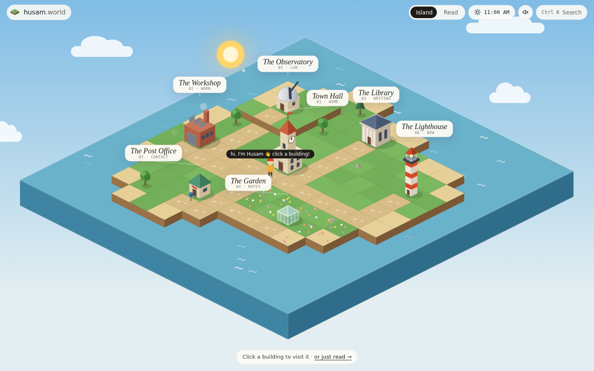
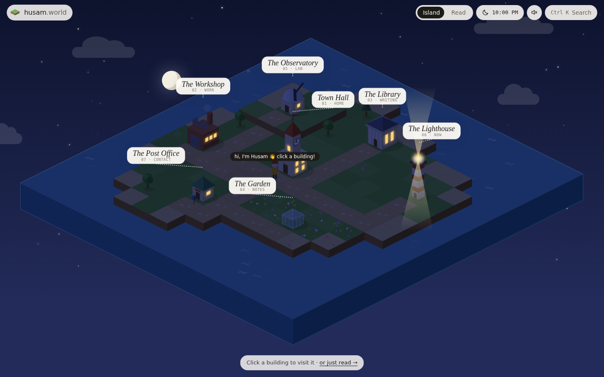
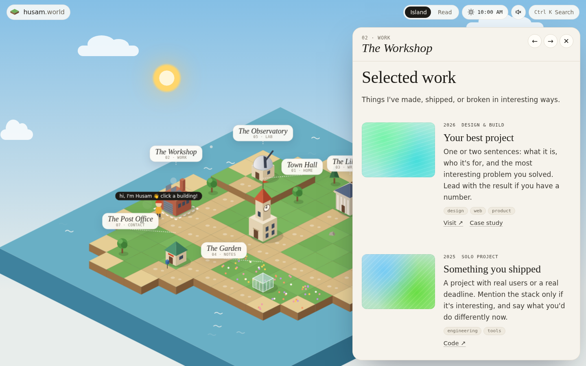
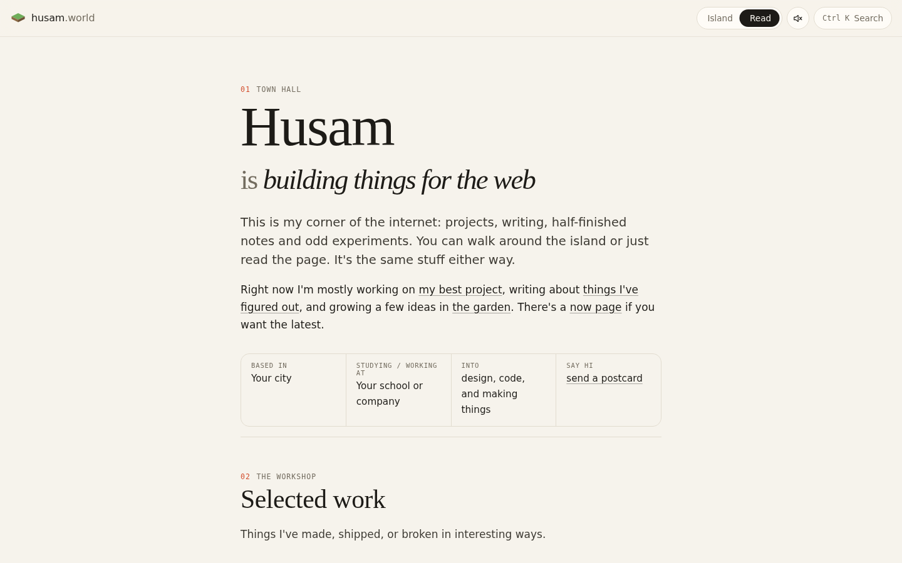

# husam.world

A personal website that's also a tiny floating island. Every section of the site is
a building. Click one and a little you walks over to it. The island follows the
**visitor's local time**: dawn, noon, golden hour, and a night with lit windows,
stars and a sweeping lighthouse beam. Press **Read** for a plain, fast, text-first
version of the same content.

| Day | Night |
|---|---|
|  |  |
|  |  |

The reasoning behind the design (which sites it borrows from, what it leaves out
and why, and what to build next) is in **[DESIGN.md](DESIGN.md)**.

## How it works

- `index.html` holds **all the content**, written once as plain HTML `<section>`s.
- `world.js` reads those sections and **generates the island** from them. Each
  `data-building` becomes a building, and roads, trees and beaches are laid out
  from the seed `husam.world`.
- `app.js` handles switching between Island and Read, the side panel, the ⌘K
  menu, link previews, garden backlinks, sounds and the small hidden extras.
- `styles.css` holds all the styling.

No framework, no build step, no dependencies. Without JavaScript you still get the
full reader page.

## Making it yours

Everything to change is marked `EDIT` in `index.html`:

1. **Intro and facts**: the Town Hall section at the top.
2. **Projects**: one `<article class="project">` each. Replace
   `<div class="thumb" …>` with `` once you have images;
   until then a cover is generated from the project's name.
3. **Writing, notes, experiments**: copy an existing item. Garden notes take
   `data-stage="seedling|budding|evergreen"`. Link notes to each other with
   `href="#note-id"` and the "Linked from" lines appear on their own.
4. **Now page**: update the text and the `datetime` on "Updated".
5. **Contact**: put your real email in `data-email` on the postcard form, and
   your profile links under it.

Anything with `data-cmd` shows up in the ⌘K search automatically.

### Adding or moving buildings

Available building types: `hall`, `workshop`, `library`, `garden`, `observatory`,
`lighthouse`, `post`. Their grid spots live in `SPOTS` at the top of `world.js`.
Remove a section and its building disappears. To add a new *kind* of building,
add an entry to `SPOTS` and a drawing function to `BUILD`.

## Running it

```sh
python3 -m http.server 8000   # then open http://localhost:8000
```

## Deploying

It's a static site. On **GitHub Pages**: Settings → Pages → Deploy from branch →
pick the branch and `/ (root)`. The `.nojekyll` file is already there. It also
works as-is on Netlify, Vercel or Cloudflare Pages. For a custom domain, add a
`CNAME` file containing the domain.

## Keyboard

| Key | Does |
|---|---|
| `⌘K` / `Ctrl K` / `/` | Command menu |
| `1`–`7` | Walk to a building |
| `←` `→` | Previous / next building (while one is open) |
| `Esc` | Close |

There are also a few words you can type anywhere. Try your own name.
